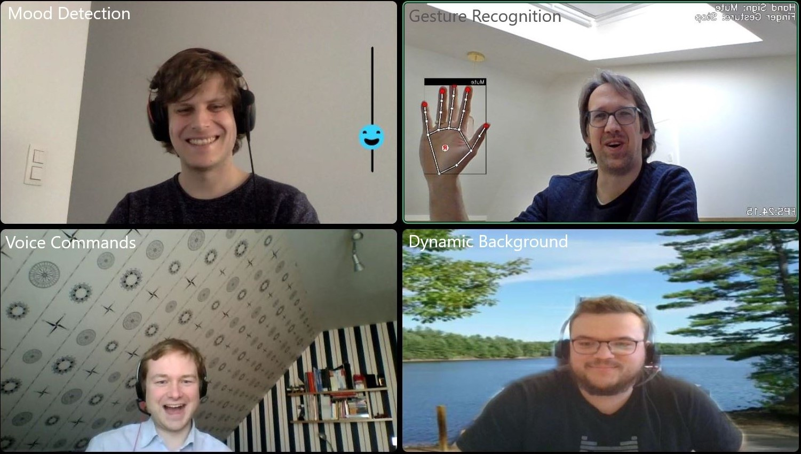
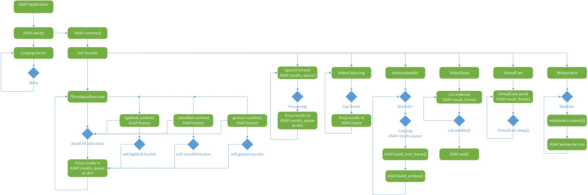
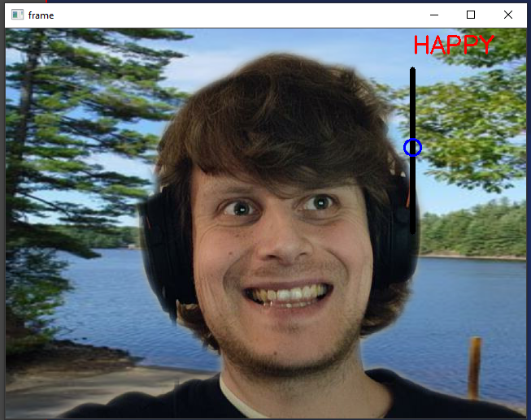

# ASAP  
  
`A:rne-S:imon-A:lexis-P:ieter-Jan`  
  
As part of the Postgraduate Artificial Intelligence course offered by the VUB and the Erasmushoogeschool in Brussels, we have selected to develop an interactive and ML-driven addition to videoconferencing. With virtual meetings on the rise, developing and improving the interaction between human participant and the videoconference is becoming an interesting field of study. We are proposing a combination of intelligent interfaces to increase this interaction, using trained Neural Networks and AI online services. Each component of the application is described below and interesting links are added to showcase the ideas and (Github) libraries we have built upon.  
  
  
  
## Application  
### Design  
<p>  
The application needed to be designed to incorporate the results of different features. After initial performance issues, the following design has proven to be operational. A Threadpool executor controls three of the threads that require the webcam frames as input. Speech recognition runs as thread connected to a Google service. Three further threads control video capture, display and the virtual camera. Finally the client side actions are handled in a thread and another websocket thread takes care of the communication between clients / participants.  
  
  
  
>The main purpose of this design is that you can build it into other applications, or extend it with say a GUI, for debugging reasons.  
  
Also the [python logging class](https://docs.python.org/3/library/logging.html) is implemented in this project.  
So it makes debugging lot's easier to do.    
The files are stored inside the ASAP main folder under the logs directory with a datatime string as filename.  
  
```python  
logging.basicConfig(filename=f"logs/{dt_string}.log", ...)  
```  
</p>  
  
### Input  
<p>  
  
#### Video  
The ASAP applications captures frame from your hardware camera with the cv2.VideoCapture class.  
  
```python  
cap = cv2.VideoCapture(0)  
```  
  
#### Sound  
Sound wave are grabbed from the [pyaudio](https://pypi.org/project/PyAudio/) module with the PyAudio class.  
```python  
audio_interface = pyaudio.PyAudio()  
```  
</p>  
  
#### Output  
<p>  
  
A virtual camera with just output frames is used with the [pyvirtualcam](https://github.com/letmaik/pyvirtualcam) module.  
Read first the Github repository before using it.   
```python  
with pyvirtualcam.Camera(width=1280, height=720, fps=20) as cam:
    while True:
        cam.send(frame) 
        cam.sleep_until_next_frame()
 ```  
  
<details>  
<summary>PyvirtualCam dependencies</summary>  
<p>  
  
Authored by [pyvirtualcam](https://github.com/letmaik/pyvirtualcam) .  
### Supported virtual cameras  
#### Windows: OBS  
  
[OBS](https://obsproject.com/) includes a built-in virtual camera for Windows (since 26.0).  
  
To use the OBS virtual camera, simply [install OBS](https://obsproject.com/).  
  
Note that OBS provides a single camera instance only, so it is *not* possible to send frames from Python to the built-in OBS virtual camera, capture the camera in OBS, mix it with other content, and output it again to OBS' built-in virtual camera. To achieve such a workflow, use another virtual camera from Python (like Unity Capture) so that OBS' built-in virtual camera is free for use in OBS.  
  
#### Windows: Unity Capture  
  
[Unity Capture](https://github.com/schellingb/UnityCapture) provides a virtual camera originally meant for streaming Unity games. Compared to most other virtual cameras it supports RGBA frames (frames with transparency) which in turn can be captured in [OBS](https://obsproject.com/) for further processing.  
  
To use the Unity Capture virtual camera, follow the [installation instructions](https://github.com/schellingb/UnityCapture#installation) on the project site.  
  
#### macOS: OBS  
  
[OBS](https://obsproject.com/) includes a built-in virtual camera for macOS (since 26.1).  
  
To use the OBS virtual camera, follow these one-time setup steps:  
- [Install OBS](https://obsproject.com/).  
- Start OBS.  
- Click "Start Virtual Camera" (bottom right), then "Stop Virtual Camera".  
- Close OBS.  
  
Note that OBS provides a single camera instance only, so it is *not* possible to send frames from Python, capture the camera in OBS, mix it with other content, and output it again as virtual camera.  
  
#### Linux: v4l2loopback  
  
pyvirtualcam uses [v4l2loopback](https://github.com/umlaeute/v4l2loopback) virtual cameras on Linux.  
  
To create a v4l2loopback virtual camera on Ubuntu, run the following:  
  
```console  
sudo apt install v4l2loopback-dkms  
sudo modprobe v4l2loopback devices=1  
```  
  
For further information, see the [v4l2loopback documentation](https://github.com/umlaeute/v4l2loopback).  
  
</p>  
</details>
  
## Installation 
```console  
# copy from github
git clone https://github.com/Puude/ASAP

# Change directory
cd ASAP

# installing venv 
python3 -m pip install --user virtualenv  

# creating virtual env  
python3 -m venv env  

# activating virtual env  
 # ------FOR LINUX/MAC---------# 
   source env/bin/activate 
 # -------FOR WINDOWS----------# 
   .\env\Scripts\activate# install requirements  
  
python3 -m pip install --user -r requirements.txt  
```  
  
## Start the app  
```console  
# View args:  
python3 main.py -h usage: tool [-h] [-n NAME] [-d DEBUG] [-g GOOGLE_CRED] [-H HEIGHT] [-W WIDTH] [-l {CRITICAL,ERROR,WARNING,INFO,DEBUG,NOTSET}]  
  
ASAP, add AI features to your camera stream.  
  
Otional arguments:  
 -h, --help                       show this help message and exit 
 -n NAME, --name NAME             User name for websocket 
 -d DEBUG, --debug DEBUG          Add debug info to logs/*.log 
 -g GOOGLE_CRED, --google_cred GOOGLE_CRED Google credentials file location 
 -H HEIGHT, --height HEIGHT       Virtual cam height 
 -W WIDTH, --width WIDTH          Virtual cam weight 
 -l, --level {CRITICAL,ERROR,WARNING,INFO,DEBUG,NOTSET} Debug level  
  
# Run app:  
python3 main.py  
```  
  
## Components  
  
Please click for further details:  
  
<details>  
<summary>Gesture Recognition</summary>  
<p>  
The Gesture Recognition component makes use of the Google-developed Mediapipe framework for hand recognition. The hand landmarks are used as coordinates that can be fed into a neural network to recognize hand gestures (and finger gestures).  
   
#### Disclaimer  
The code makes use of existing libraries and is based in large parts on the following repositories:  
* It uses the Mediapipe framework published by Google: https://mediapipe.dev/  
* It is based on code published by Kazuhito00 on Github: https://github.com/Kazuhito00/hand-gesture-recognition-using-mediapipe/blob/main/README_EN.md  
published under Apache 2.0 licence: https://github.com/Kazuhito00/hand-gesture-recognition-using-mediapipe/blob/main/LICENSE  
* It uses hand gestures trained by kinivi, his neural network design and Jupyter notebook from Github: https://github.com/kinivi/tello-gesture-control published under Apache 2.0 licence: https://github.com/kinivi/tello-gesture-control/blob/main/LICENSE  
  
#### Research  
The initial setup was clarified relatively quickly: The gesture recognition needed to be able to identify hands in 
webcam frames that are passed by the central application. In order to be able to interact with the user, the results 
need a way to be displayed on the image that is returned to the central application (or annotation added there), 
before being sent via virtual camera to the standard videoconferencing application (MS Teams or Discord).    
  
The initial research discovered multiple datasets where hand gestures were collected and used to train Neural Networks. 
Examples are the 20GB Jester Dataset https://20bn.com/datasets/jester/v1 or the egocentric gesture dataset 
EgoGesture http://www.nlpr.ia.ac.cn/iva/yfzhang/datasets/egogesture.html. Using these well documented datasets and 
the models that made use of them, the first idea how to approach the gesture recognition was formed. However, given 
the size of these datsets, Convolutional Neural Network processing was expected high in training time and effort. 
Other options to efficiently recognize the hands were to use RGB values detection, edge detection or 
background subtraction. All of these options would have required effort to build, test and validate the hand 
recognition before beeing able to get to gesture detection.    

Luckily, Google Mediapipe was discovered. It is a relative lightweight Machine Learning solution that recognizes hands 
(amongst others) and is available as Python library 
https://google.github.io/mediapipe/solutions/hands#python-solution-api. Having the possible to translate hands and 
fingers into coordinates, the next step was to search for gesture detection solutions on Github. The above linked 
framework by Kazuhito00 provided a well documented approach using the coordinates as input and two Neural Networks, 
one for gesture detection and one for (index) finger movement detection. In the original solution, the functionality 
to save a time series of hand gestures and coordinates and to use it to train the Neural Network was available in 
a Jupyter Notebook.    

Inspired by the second repository by kinivi linked above, additional hand gestures were trained. 
Due to the existing translation in coordinates, the Neural Network is very simple and provides a high detection accuracy
at very low sample size.  
  
#### Machine Learning (ML) / Artificial Intelligence (AI)  
ML/AI is used in this component to identify hand gestures in webcam images. The Google mediapipe framework allows 
to identify one or both hand(s) and returns the coordinates of hand, fingers and joints.  
    
These coordinates are transformed in three steps: from the Mediapipe landmarks to relative coordinates, 
then the x/y components are separated and the resulting variables normalized.   
    
The neural network is a simple one with three fully connected RELU layers followed by a Softmax translation to the 
discrete results (originally 8, for our purposes one added): <br />  
    
The model training is executed in a Jupyter notebook. The neural network is fed with the normalized coordinates and 
the labels that indicate the hand gesture. The model achieves around 99.96% accuracy in around 100 epochs. 
The saved model is transformed into a tflite model and used to infer the hand gestures from the webcam images 
(pre-evaluated through Mediapipe)  
  
#### Further Interesting Links  
* Mediapipe Demo  
  * <a href="https://mediapipe.dev/demo/holistic_remote/" target="blank">Holistic Mediapipe demo</a>  
   
  
 
</details>  
  
<details>  
<summary>Voice Commands / Text-2-Speech</summary>  
<p>  
The speech recognition is done by a service of Google. At first an own model   
was trained, however this was not satisfying. Not a single word was recognised  
properly. By using the service of Google a more reliable result is obtained,   
however there is still room for improvement.  
  
#### Disclaimer  
This code makes use of an existing service of Google.   
* The service can be found at: https://cloud.google.com/speech-to-text  
* The basic code can be found on GitHub: https://github.com/googleapis/python-speech/tree/master/samples  
  
#### Research
Like mentioned during the introduction of this part, we were not able to make a speech recognition model by 
ourselves. An attempt was made by using the DeepSpeech project (https://github.com/mozilla/DeepSpeech).
It offers some pre-trained models, but it is also possible to train your own model. The model is trained by using 
TensorFlow and it is highly recommended to activate the GPU support. More information on creating an own speech 
recognition model can be found here: https://deepspeech.readthedocs.io/en/r0.9/TRAINING.html

It was hard and time-consuming to create an own model, and it would not be possible to include one of our features.
The feature of writing down a transcript would not be possible to have if a self trained model was used. Besides
the possible reduction on amount of features, the results produced by the model were not very satisfying. The 
trained sentences and commands, to be used for interaction with our application, were not recognised properly.

Therefor, a switch was made to the Google service for speech recognition (https://cloud.google.com/speech-to-text).
It is possible to sign up to test the service for free. The duration of the free test period
is long enough to finish this project. It is possible to use very specific trained models for
selected applications like for video and phone calls. However, these do not follow the
standard billing. Therefore, the default model for streaming speech recognition was selected.
This should fit our needs.

Even with the powerful model of Google, we encounter still that some words or sentences are
not recognised in a proper way. This shows that it would be very hard to train an own, well 
performing model.

#### Machine Learning (ML) / Artificial Intelligence (AI)  
* From the Google service is the API of the streaming speech recognition used. 
  Real-time speech is recorded by the ASAP-application and is send to Google.
  The speech recognition is synchronous, so it is blocking. A new request can be handle, whenever the previous one is
  processed. However, every client has it's own connection to the Google API.
  
* The response of the API can be seen underneath. The result is returned with possible alternatives of different
  transcripts and the conficence level accordingly. 
```console
{
  "results": [
    {
      "alternatives": [
        {
          "confidence": 0.51246254,
          "transcript": "Speech recognition is awesome"
        }
        {
          "confidence": 0.99999999,
          "transcript": "The ASAP application is awesome"
        }
      ]
    }
  ]
}
``` 
* For this application we only use the first of possible alternatives when the response arrives. This transcript is
  passed through the main class as a string where it is compared to predefined expressions, using regular expression or
  REGEX.
* Because the string is checked for exact matching the commands, some commands are not recognised. This topic will
be discussed during the furter steps.
#### Further steps
* Because a part of the returned string must match the predefined command exactly, it is sometimes hard to enter the 
command mode or to execute a command. A solution could be to add more variants and be more tolerant during the matching
  between the returned string and the defined commands.
  
* However it is hard to train an own model, this could be done for the specific commands and action words. By using an 
self trained model for this, the commands could be recognised more easily.

#### Further Interesting Links  

https://github.com/mozilla/DeepSpeech

https://cloud.google.com/speech-to-text  

https://cloud.google.com/speech-to-text  
</p>  
</details>  
  
<details><summary>Mood Detection</summary>  
<p>  
...  
</p>  
</details>  
  
<details><summary>Dynamic Background</summary>  
<p>  
<p>  
This feature predict a background mask of the input image.  
  
#### Disclaimer.  
All credits to [Anilsathyan7](https://github.com/anilsathyan7/Portrait-Segmentation) to explain this technique verry well, and share us his repository.     
Special thanks!  
  
  
#### Research.  
Background masking, is in fact a segmentation technique.    
To speed up the performance, the model is limited to a binairy class (person or background). Therefor an portrait-selfie [dataset](https://onedrive.live.com/?cid=f5111408123b1d9c&id=F5111408123B1D9C%2115035&authkey=!ADkS4V32BUmspOg) was used.  
  
#### Machine Learning (ML) / Artificial Intelligence (AI)  
The dataset consists of 18698 human portrait images of size 128x128 in RGB format, along with their masks (alphablending). Here we augment the dataset with handpicked (to ensure the dataset quality) portrait images form supervisely dataset. Additionaly, we download random selfie images from web and generate their masks using state-of-the-art deeplab-xception model for semantic segmentation.  
To increase the volume of the dataset and make the model more robustness, additional techniques where used. Some techniques: cropping, adjusting brightness, flipping images, blurring.  
Also since most of the images contain plain background, synthetic images where introduced that change randomly the background from the anotated dataset.  
  
> The result is an background masking feature that runs at 10 fps.  
  
</details>  
  
## Features  
  
### Voice / Gesture Commands  
  Both voice commands and gestures are used to interact with the video conferencing   
tool and with the videoconference participants. Voice commands are activated by   
saying _the italic words_, gesture commands are activated by doing   
**the bold instructions**. Currently the following commands are supported:  
  
<details>  
<summary>Command Mode</summary>  
<p>  
   
* Move into command mode:  
  * **Show two hands to the webcam**   
  * _command mode on_  
* Cancel command mode:   
  * **Show two hands again**  
  * _command mode off_  
</p>  
</details>   
  
<details>  
<summary>Audio</summary>  
<p>  
   
* Mute the microphone:   
  * **Show flat palm of one hand**  
  * _mute_ or _toggle mute_ when unmuted   
* Un-mute the microphone:   
  * **Make an upward fist**  
  * _unmute_ or _toggle mute_ when muted   
* Increase the volume:   
  * **Index finger up (and thumb to the side)**  
  * _volume up_  
* Decrease the volume:   
  * **Index finger down (and thumb to the side)**  
  * _volume down_  
</p>  
</details>   
  
<details>  
<summary>Video</summary>  
<p>  
   
* Black out the Camera:   
  * **Point fist at the camera**  
  * _camera off_  
* Return to Webcam display:   
  * **Show upwards fist (same as un-mute)**  
  * _camera on_  
</p>  
</details>   
  
<details>  
<summary>Background</summary>  
<p>  
   
* Change the Background one-forward:   
  * **Fist with thumb to one side**  
  * _background right_  
* Change the Background one-backward:   
  * **Fist with thumb to the other side**  
  * _background left_  
* Change the Background to a random one:  
  * _change background_  
</p>  
</details>   
  
<details>  
<summary>Voting</summary>  
<p>   
   
* Begin a voting process:   
  * **Victory sign**  
  * _voting on_  
* Set the number of options:   
  * Indicate yes/no question:   
     * **Thumbs-up sign**  
  * **Show number of fingers [1..5]**  
* Confirm the number of options displayed:   
  * **OK sign**  
  
--- Explain the options to the group ---  
  
* Start the voting:   
  * **Victory sign**  
  * _voting on_  
* Cast your vote:   
  * In case of yes/no:   
     * **Show thumbs-up*  
 * _I vote yes_ or _I vote no_  
 * In case of more options:   
     * **Show number with your fingers**  
 * _option [1..5]_ or _option [A..E]_  
* Confirm vote:   
  * **OK sign**  
  
[not implemented]  
--- Once all participants have voted, display the result on all screens ---  
</p>  
</details>   
  
## The End  
  

