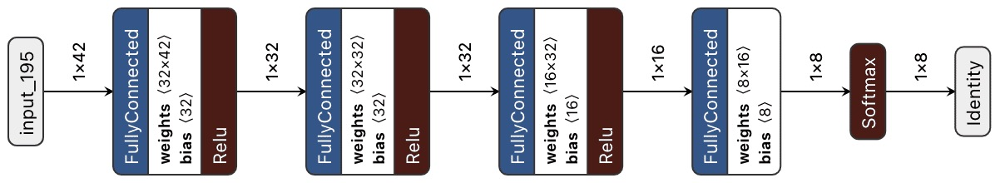

# ASAP

`A:rne-S:imon-A:lexis-P:ieter-Jan`

As part of the Postgraduate Artificial Intelligence course offered by the VUB and the Erasmushoogeschool in Brussels, we have selected to develop an interactive and ML-driven addition to videoconferencing. With virtual meetings on the rise, developing and improving the interaction between human participant and the videoconference is becoming an interesting field of study. We are proposing a combination of intelligent interfaces to increase this interaction, using trained Neural Networks and AI online services. Each component of the application is described below and interesting links are added to showcase the ideas and (Github) libraries we have built upon.


## Installation

## Installation

First: 
```bash
# installing venv 
python3 -m pip install --user virtualenv
# creating virtual env
python3 -m venv env
# activating virtual env
  # ------FOR LINUX/MAC---------#
    source env/bin/activate
  # -------FOR WINDOWS----------#
    .\env\Scripts\activate
# install requirements
python3 -m pip install --user -r requirements.txt
```

```bash
# View args:
python3 main.py -h 

# Run app:
python3 main.py
```

## Application

The application needed to be designed to incorporate the results of different features. After initial performance issues, the following design has proven to be operational. A Threadpool executor controls three of the threads that require the webcam frames as input. Speech recognition runs as thread connected to a Google service. Three further threads control video capture, display and the virtual camera. Finally the client side actions are handled in a thread and another websocket thread takes care of the communication between clients / participants.


The main prop
## Components

Please click for further details:

<details>
<summary>Gesture Recognition</summary>
<p>
The Gesture Recognition component makes use of the Google-developed Mediapipe framework for hand recognition. The hand landmarks are used as coordinates that can be fed into a neural network to recognize hand gestures (and finger gestures).
 
#### Disclaimer
The code makes use of existing libraries and is based in large parts on the following repositories:
* It uses the Mediapipe framework published by Google: https://mediapipe.dev/
* It is based on code published by Kazuhito00 on Github: https://github.com/Kazuhito00/hand-gesture-recognition-using-mediapipe/blob/main/README_EN.md
published under Apache 2.0 licence: https://github.com/Kazuhito00/hand-gesture-recognition-using-mediapipe/blob/main/LICENSE
* It uses hand gestures trained by kinivi, his neural network design and Jupyter notebook from Github: https://github.com/kinivi/tello-gesture-control published under Apache 2.0 licence: https://github.com/kinivi/tello-gesture-control/blob/main/LICENSE

#### Research
The initial setup was clarified relatively quickly: The gesture recognition needed to be able to identify hands in webcam frames that are passed by the central application. In order to be able to interact with the user, the results need a way to be displayed on the image that is returned to the central application (or annotation added there), before beeing sent via virtual camera to the standard videoconferencing application (MS Teams or Discord).  
The initial research discovered multiple datasets where hand gestures were collected and used to train Neural Networks. Examples are the 20GB Jester Dataset
https://20bn.com/datasets/jester/v1 or the egocentric gesture dataset EgoGesture http://www.nlpr.ia.ac.cn/iva/yfzhang/datasets/egogesture.html. Using these well documented datasets and the models that made use of them, the first idea how to approach the gesture recognition was formed. However, given the size of these datsets, Convolutional Neural Network processing was expected high in training time and effort. Other options to efficiently recognize the hands were to use RGB values detection, edge detection or background subtraction. All of these options would have required effort to build, test and validate the hand recognition before beeing able to get to gesture detection.  
Luckily, Google Mediapipe was discovered. It is a relative lightweight Machine Learning solution that recognizes hands (amongst others) and is available as Python library https://google.github.io/mediapipe/solutions/hands#python-solution-api. Having the possible to translate hands and fingers into coordinates, the next step was to search for gesture detection solutions on Github. The above linked framework by Kazuhito00 provided a well documented approach using the coordinates as input and two Neural Networks, one for gesture detection and one for (index) finger movement detection. In the original solution, the functionality to save a time series of hand gestures and coordinates and to use it to train the Neural Network was available in a Jupyter Notebook.  
Inspired by the second repository by kinivi linked above, additional hand gestures were trained. Due to the existing translation in coordinates, the Neural Network is very simple and provides a high detection accuracy at very low sample size.

#### Machine Learning (ML) / Artificial Intelligence (AI)
ML/AI is used in this component to identify hand gestures in webcam images. The Google mediapipe framework allows to identify one or both hand(s) and returns the coordinates of hand, fingers and joints.
  
These coordinates are transformed in three steps: from the Mediapipe landmarks to relative coordinates, then the x/y components are separated and the resulting 
variables normalized. 
  
The neural network is a simple one with three fully connected RELU layers followed by a Softmax translation to the discrete results (originally 8, for our purposes one added): <br />
  
The model training is executed in a Jupyter notebook. The neural network is fed with the normalized coordinates and the labels that indicate the hand gesture. The model achieves around 99.96% accuracy in around 100 epochs. The saved model is transformed into a tflite model and used to infer the hand gestures from the webcam images (pre-evaluated through Mediapipe)

#### Further Interesting Links
* Mediapipe Demo
  * <a href="https://mediapipe.dev/demo/holistic_remote/" target="blank">Holistic Mediapipe demo</a>
 

 </p>
</details>

<details>
<summary>Voice Commands / Text-2-Speech</summary>
<p>
The speech recognition is done by a service of Google. At first an own model 
was trained, however this was not satisfying. Not a single word was recognised
properly. By using the service of Google a more reliable result is obtained, 
however there is still room for improvement.

#### Disclaimer
This code makes use of an existing service of Google. 
* The service can be found at: https://cloud.google.com/speech-to-text
* The basic code can be found on GitHub: https://github.com/googleapis/python-speech/tree/master/samples
* 
#### Machine Learning (ML) / Artificial Intelligence (AI)
@TODO further writing, now just keywords.
* Streaming speech recognition 	
  Receive real-time speech recognition results as the API processes 
  the audio input streamed from your application’s microphone or sent from 
  a prerecorded audio file (inline or through Cloud Storage).
  
* using returned string
#### Further Interesting Links

</p>
</details>

<details><summary>Mood Detection</summary>
<p>
...
</p>
</details>

<details><summary>Dynamic Background</summary>
<p>
<p>
This feature predict a background mask of the input image.

#### Disclaimer.
All credits to [Anilsathyan7](https://github.com/anilsathyan7/Portrait-Segmentation) to explain this technique verry well, and share us his repository.   
Special thanks!


#### Research.
Background masking, is in fact a segmentation technique.  
To speed up the performance, the model is limited to a binairy class (person or background). Therefor an portrait-selfie [dataset](https://onedrive.live.com/?cid=f5111408123b1d9c&id=F5111408123B1D9C%2115035&authkey=!ADkS4V32BUmspOg) was used.

#### Machine Learning (ML) / Artificial Intelligence (AI)
The dataset consists of 18698 human portrait images of size 128x128 in RGB format, along with their masks (alphablending). Here we augment the dataset with handpicked (to ensure the dataset quality) portrait images form supervisely dataset. Additionaly, we download random selfie images from web and generate their masks using state-of-the-art deeplab-xception model for semantic segmentation.
To increase the volume of the dataset and make the model more robustness, additional techniques where used. Some techniques: cropping, adjusting brightness, flipping images, blurring.
Also since most of the images contain plain background, synthetic images where introduced that change randomly the background from the anotated dataset.

> The result is an backgrond masking feature that runs at 10 fps.

</details>

## Features

### Voice / Gesture Commands
 
Both voice commands and gestures are used to interact with the video conferencing 
tool and with the videoconference participants. Voice commands are activated by 
saying _the italic words_, gesture commands are activated by doing 
**the bold instructions**. Currently the following commands are supported:

<details>
<summary>Command Mode</summary>
<p>
 
* Move into command mode:
  * **Show two hands to the webcam** 
  * _command mode on_
* Cancel command mode: 
  * **Show two hands again**
  * _command mode off_
</p>
</details> 

<details>
<summary>Audio</summary>
<p>
 
* Mute the microphone: 
  * **Show flat palm of one hand**
  * _mute_ or _toggle mute_ when unmuted 
* Un-mute the microphone: 
  * **Make an upward fist**
  * _unmute_ or _toggle mute_ when muted 
* Increase the volume: 
  * **Index finger up (and thumb to the side)**
  * _volume up_
* Decrease the volume: 
  * **Index finger down (and thumb to the side)**
  * _volume down_
</p>
</details> 

<details>
<summary>Video</summary>
<p>
 
* Black out the Camera: 
  * **Point fist at the camera**
  * _camera off_
* Return to Webcam display: 
  * **Show upwards fist (same as un-mute)**
  * _camera on_
</p>
</details> 

<details>
<summary>Background</summary>
<p>
 
* Change the Background one-forward: 
  * **Fist with thumb to one side**
  * _background right_
* Change the Background one-backward: 
  * **Fist with thumb to the other side**
  * _background left_
* Change the Background to a random one:
  * _change background_
</p>
</details> 

<details>
<summary>Voting</summary>
<p> 
 
* Begin a voting process: 
  * **Victory sign**
  * _voting on_
* Set the number of options: 
   * Indicate yes/no question: 
     * **Thumbs-up sign**
   * **Show number of fingers [1..5]**
* Confirm the number of options displayed: 
  * **OK sign**

--- Explain the options to the group ---

* Start the voting: 
  * **Victory sign**
  * _voting on_
* Cast your vote: 
   * In case of yes/no: 
     * **Show thumbs-up*
     * _I vote yes_ or _I vote no_
   * In case of more options: 
     * **Show number with your fingers**
     * _option [1..5]_ or _option [A..E]_
* Confirm vote: 
  * **OK sign**

[not implemented]
--- Once all participants have voted, display the result on all screens ---
</p>
</details> 

## The End


