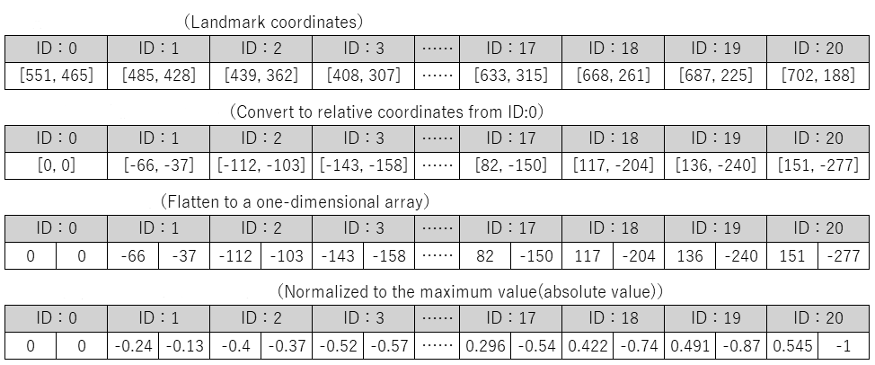

# ASAP

As part of the Postgraduate Artificial Intelligence course offered by the VUB and the Erasmushoogeschool in Brussels, we have selected to develop an interactive and ML-driven addition to videoconferencing. With virtual meetings on the rise, developing and improving the interaction between human participant and the videoconference is becoming an interesting field of study. We are proposing a combination of intelligent interfaces to increase this interaction, using trained Neural Networks and AI online services. Each component of the application is described below and interesting links are added to showcase the ideas and (Github) libraries we have built upon.


## Installation

First: 
```shell
# installing venv 
python3 -m pip install --user virtualenv
# creating virtual env
python3 -m venv env
# activating virtual env
# ------FOR LINUX/MAC---------#
source env/bin/activate
# -------FOR WINDOWS----------#
.\env\Scripts\activate

python3 -m pip install --usere -r requirements.txt
```

Then open main.py in IDE

```python
# Make sure that the google credentials are correct.
asap = ASAP(google_credentials="/folder_to/asap-309508-7398a8c4473f.json")
# And start the ASAP application
asap.start()
```

## Components

<details>
<summary>Gesture Recognition</summary>
<p><p />
The Gesture Recognition component makes use of the Google-developed Mediapipe framework for hand recognition. The hand landmarks are used as coordinates that can be fed into a neural network to recognize hand gestures (and finger gestures).
 
#### Disclaimer
The code makes use of existing libraries and is based in large parts on the following repositories:
* It uses the Mediapipe framework published by Google: https://mediapipe.dev/
* It is based on code published by Kazuhito00 on Github: https://github.com/Kazuhito00/hand-gesture-recognition-using-mediapipe/blob/main/README_EN.md
published under Apache 2.0 licence: https://github.com/Kazuhito00/hand-gesture-recognition-using-mediapipe/blob/main/LICENSE
* It uses hand gestures trained by kinivi, his neural network design and Jupyter notebook from Github: https://github.com/kinivi/tello-gesture-control published under Apache 2.0 licence: https://github.com/kinivi/tello-gesture-control/blob/main/LICENSE

#### Machine Learning (ML) / Artificial Intelligence (AI)
ML/AI is used in this component to identify hand gestures in webcam images. The Google mediapipe framework allows to identify one or both hand(s) and returns the coordinates of hand, fingers and joints.

<p />
These coordinates are transformed in three steps: from the Mediapipe landmarks to relative coordinates, then the x/y components are separated and the resulting 
variables normalized. 

<p />
The Neural Network is a simple neural network with three fully connected RELU layers followed by a Softmax translation to the discrete results (originally 8, for our purposes one added):

<p />
The model training is executed in a Jupyter notebook. The neural network is fed with the normalized coordinates and the labels that indicate the hand gesture. The model achieves around 99.96% accuracy in around 00 epochs. The saved model is transformed into a tflite model and used to infer the hand gestures from the webcam images (pre-evaluated through Mediapipe)
 
 #### Further Links
* Mediapipe Demo
  * <a href="https://mediapipe.dev/demo/holistic_remote/" target="blank">Holistic Mediapipe demo</a>

</p></details>

<details><summary>Voice Commands / Text-2-Speech</summary>
<p><p />
...
</p>
</details>

<details><summary>Mood Detection</summary>
<p><p />
...
</p>
</details>

<details><summary>Dynamic Background</summary>
<p><p />
...
</p>
</details>

## (Potential) Features

- [x] Voting workflow
- [ ] Play sound when average mood exceeds threshold
